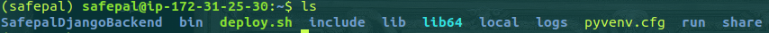

======================
Safepal Documentation
======================

Introduction
============

Safepal is an app that helps report GBV related cases. Provide users with educational content and access to CSOs

Tools
============

#. Django
#. Django Rest Framework
#. Python3
#. Wagtail
#. Swagger
#. Firebase
#. Redis
#. Celery
#. Supervisord
#. Nginx
#. FFmpeg

Resources
============
* Deployment

https://simpleisbetterthancomplex.com/tutorial/2016/10/14/how-to-deploy-to-digital-ocean.html

* Celery

https://medium.com/analytics-vidhya/integrating-django-signals-and-celery-cb2876ebd494
https://www.codingforentrepreneurs.com/blog/celery-redis-django/
https://code.tutsplus.com/tutorials/using-celery-with-django-for-background-task-processing--cms-28732

https://simpleisbetterthancomplex.com/tutorial/2017/08/20/how-to-use-celery-with-django.html#starting-the-worker-process
https://stackoverflow.com/questions/28643011/deploy-django-project-with-celery

* Redis

https://www.digitalocean.com/community/tutorials/how-to-install-and-secure-redis-on-ubuntu-18-04

* FFmpeg

https://github.com/aminyazdanpanah/python-ffmpeg-video-streaming

Server Deployment
===================
Setup EC2 instance
-------------------

#. Log into the Safepal AWS account
#. Go to Services > compute > EC2.
#. Click on Launch Instance.
#. Select Ubuntu Server 18.04 TLS(or higher)
#. Click Review and Launch > Launch .
#. Use existing pair(please check the documentation folder for the pem file sellio_aws_instance.pem
#. Finally Click on Launch Instances.

SSH  into the Server, Install dependencies & setup postgreSql
----------------------------------------------------------------

#. cd Desktop/
#. sudo chmod 400 sellio_aws_instance.pem
#. ssh -i sellio_aws_instance.pem ubuntu@public_ip_address
#. sudo apt-get update && apt-get upgrade -y
#. sudo apt-get install python-pip python-dev libpq-dev postgresql postgresql-contrib nginx git
#. sudo apt-get install python3-venv
#. sudo apt-get -y install postgresql postgresql-contrib
#. sudo apt-get -y install nginx
#. sudo apt-get -y install supervisor
#. sudo apt install redis-server
#. sudo add-apt-repository ppa:jonathonf/ffmpeg-4
#. sudo apt-get update
#. sudo apt-get install ffmpeg
#. source venv/bin/activate(or install without env)
#. pip install django
#. pip install -r requirements.txt
#. git clone https://github.com/UNFPAInnovation/SafepalDjangoBackend.git

.. note:: All servers in the Safepal Project use the sellio_aws_instance.pem.

.. warning:: Activate allowed hosts in /home/ubuntu/SafepalDjangoBackend/SafepalDjangoBackend/settings.py ALLOWED_HOSTS = ['*']
    Requests may not work if not activated or add the actual IP address of the server

Enable supervisor

.. code-block:: python
    
    sudo systemctl enable supervisor
    sudo systemctl start supervisor

Configure Postgres
---------------------

.. code-block:: console
    su - postgres
    createuser safepaluser
    createdb safepaldb --owner safepaluser
    psql -c "ALTER USER safepaluser WITH PASSWORD '123'"
    exit

Configure The Application User
-------------------------------

.. code-block:: console
    adduser safepal
    gpasswd -a safepal sudo
    su - safepal

Configure python environment
--------------------------------

Clone the project and install requirements

.. code-block:: console
    python3 -m venv .
    source bin/activate
    git clone https://github.com/UNFPAInnovation/SafepalDjangoBackend.git
    pip install -r requirements.txt

Add the database configs

.. code-block:: python
    DATABASES = {
        'default': {
            'ENGINE': 'django.db.backends.postgresql_psycopg2',
            'NAME': 'dbname',
            'USER': 'username',
            'PASSWORD': 'password',
            'HOST': 'localhost',
            'PORT': '',
        }
    }

Run migrations

.. code-block:: console
    python manage.py migrate
    python manage.py collectstatic

Test if the server is running by running 

.. code-block:: console
    
    python manage.py runserver 0.0.0.0:8000

Configure gunicorn
----------------------

Install gunicorn

.. code-block:: console
    
    pip install gunicorn

Add the code `vim home/safepal/bin/gunicorn_start`

.. code-block:: console
    
    #!/bin/bash

    NAME="safepaltest"
    DIR=/home/safepal/SafepalDjangoBackend
    USER=safepal
    GROUP=safepal
    WORKERS=3
    BIND=unix:/home/safepal/run/gunicorn.sock
    DJANGO_SETTINGS_MODULE=SafepalDjangoBackend.settings
    DJANGO_WSGI_MODULE=SafepalDjangoBackend.wsgi
    LOG_LEVEL=error

    cd $DIR
    source ../bin/activate

    export DJANGO_SETTINGS_MODULE=$DJANGO_SETTINGS_MODULE
    export PYTHONPATH=$DIR:$PYTHONPATH
    export PASSWORD=safepal123

    exec ../bin/gunicorn ${DJANGO_WSGI_MODULE}:application \
      --name $NAME \
      --workers $WORKERS \
      --user=$USER \
      --group=$GROUP \
      --bind=$BIND \
      --log-level=$LOG_LEVEL \
      --log-file=-

Change permission of gunicorn_start

.. code-block:: console

    chmod u+x bin/gunicorn_start

Make directory run

.. code-block:: console
    
    mkdir /home/safepal/run

Folder structure

Configure redis server
-----------------------

Edit redis settings

.. code-block:: python

    sudo vim /etc/redis/redis.conf

Allow systemd to run redis in a daemon

.. code-block:: python

    supervised systemd
    6380

Restart redis

.. code-block:: python

    sudo systemctl restart redis.service

Configure supervisor
-----------------------

Create config files and log files

.. code-block:: console
    
    mkdir logs
    touch logs/gunicorn-error.log
    /etc/supervisor/conf.d/safepal-program.conf

Add service to run gunicorn and reddis

.. code-block:: python
    [program:safepal-program3]
    command=/home/safepal/bin/gunicorn_start
    user=safepal
    autostart=true
    autorestart=true
    redirect_stderr=true
    stdout_logfile=/home/safepal/logs/gunicorn-error.log

    [program:safepal-celery]
    command=/home/safepal/bin/celery worker -A SafepalDjangoBackend --loglevel=INFO
    directory=/home/safepal/SafepalDjangoBackend
    user=safepal
    numprocs=1
    stdout_logfile=/home/safepal/logs/celery.log
    stderr_logfile=/home/safepal/logs/celery.log
    autostart=true
    autorestart=true
    startsecs=10

    ; Need to wait for currently executing tasks to finish at shutdown.
    ; Increase this if you have very long running tasks.
    stopwaitsecs = 600

    stopasgroup=true

    ; Set Celery priority higher than default (999)
    ; so, if redis is supervised, it will start first.
    priority=1000

.. code-block:: console

    sudo supervisorctl reread
    sudo supervisorctl update
    sudo supervisorctl restart safepal-program3
    sudo supervisorctl restart safepal-celery

Add static files and collect static
-------------------------------------

Add these lines to the `/home/ubuntu/SafepalDjangoBackend/SafepalDjangoBackend/settings.py`

.. code-block:: python

    STATIC_URL = '/static/'
    STATIC_ROOT = os.path.join(BASE_DIR, 'static/')

Then collect static files

.. code-block:: console

    source venv/bin/activate
    (venv)$ python manage.py collectstatic

**Explanation:** This allows the static files like css and images to get rendered in django admin dashboard and swagger

Configure Nginx to Proxy Pass to Gunicorn
~~~~~~~~~~~~~~~~~~~~~~~~~~~~~~~~~~~~~~~~~~

Create file named safepal-program
sudo vim /etc/nginx/sites-available/safepal-program

Insert the following commands

.. code-block:: python

    upstream app_server {
        server unix:/home/safepal/run/gunicorn.sock fail_timeout=0;
    }

    server {
        listen 80;

        # add here the ip address of your server
        # or a domain pointing to that ip (like example.com or www.example.com)
        server_name 54.213.147.100;

        keepalive_timeout 5;
        client_max_body_size 4G;

        access_log /home/safepal/logs/nginx-access.log;
        error_log /home/safepal/logs/nginx-error.log;

        location /static/ {
            alias /home/safepal/SafepalDjangoBackend/SafepalDjangoBackend/static/;
        }

        # checks for static file, if not found proxy to app
        location / {
            try_files $uri @proxy_to_app;
        }

        location @proxy_to_app {
          proxy_set_header X-Forwarded-For $proxy_add_x_forwarded_for;
          proxy_set_header Host $http_host;
          proxy_redirect off;
          proxy_pass http://app_server;
        }
    }

Enable the file by linking it to the sites-enabled directory

.. code-block:: console

    sudo ln -s /etc/nginx/sites-available/safepal-program /etc/nginx/sites-enabled
    sudo service nginx restart

Update of code and server
--------------------------

.. code-block:: console

    ssh ubuntu@IPADDRESS
    su - safepal (then enter password)
    source bin/activate
    cd SafepalDjangoBackend
    git add .
    git stash save
    git pull origin master
    python manage.py collectstatic
    python manage.py migrate
    sudo supervisorctl restart safepal-program3